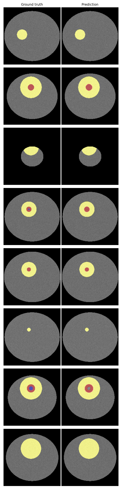

# 🧠 TumorTrace

**TumorTrace draws the exact boundary of a brain tumor on an MRI scan in seconds — trained on 369 real glioma patients from the BraTS 2020 challenge.**

> ⚠️ **This is a research and educational prototype, not a medical device.** It has not been clinically validated and must never be used for actual diagnosis or treatment decisions. Segmentation outputs should only ever be interpreted by a qualified radiologist or neuro-oncologist.



**[→ View the product site](site/index.html)** — a standalone, three.js-animated overview of the project (`site/index.html`). Serve it locally with `python -m http.server` from the repo root and open `http://localhost:8000/site/index.html`, or deploy the `site/` folder as-is to GitHub Pages/Vercel/Netlify. Before deploying, edit the two config values at the bottom of `site/index.html` (`appUrl`, `githubUrl`) to point at your deployed Streamlit app and repo.

---

## How it works

TumorTrace takes four co-registered MRI sequences of the same patient's brain — T1, T1ce (contrast-enhanced), T2, and FLAIR — because each sequence lights up different tumor tissue: T1ce highlights the actively enhancing tumor rim, FLAIR and T2 make the surrounding swelling (edema) obvious, and T1 gives the baseline anatomy. The four volumes are stacked into a 4-channel image and fed slice-by-slice into a U-Net (a ResNet34 pretrained on ImageNet as the encoder), which outputs, for every pixel, a probability over four classes: background, necrotic/non-enhancing core, edema, and enhancing tumor. Predictions are stitched back into a 3D volume, colorized, and overlaid on the scan so the tumor's shape, extent, and sub-region composition are visible at a glance.

## App features

Beyond the core "upload scans, see overlay" flow, the Streamlit app includes:

- **Multi-planar viewing** — independent Axial / Sagittal / Coronal tabs reformatted from the same predicted 3D volume.
- **Model-confidence heatmap** — toggle the overlay to show per-voxel max-softmax confidence instead of the label mask, to see where the model is unsure.
- **Overlay controls** — adjustable opacity and per-sub-region visibility (isolate the enhancing rim, hide edema, etc.).
- **Tumor-extent profile** — a per-plane chart of tumor voxel count across all slices, marking the current slice, so you can jump straight to the largest cross-section.
- **Downloadable markdown report** — per-region volumes and key slice indices, alongside the predicted mask `.nii.gz` download.

## Architecture

```
                      ┌─────────────────────────────┐
  T1    ──┐           │                             │
  T1ce  ──┼── stack ──▶  4-channel (192×192) slice   │
  T2    ──┤           │                             │
  FLAIR ──┘           └───────────────┬─────────────┘
                                       │
                                       ▼
                     ┌──────────────────────────────────┐
                     │   U-Net (segmentation_models_    │
                     │   pytorch), ResNet34 encoder,     │
                     │   ImageNet-pretrained             │
                     └───────────────┬────────────────────┘
                                       │  4-class logits (192×192)
                                       ▼
                     ┌──────────────────────────────────┐
                     │ argmax → {bg, necrotic, edema,    │
                     │ enhancing} pixel labels           │
                     └───────────────┬────────────────────┘
                                       │  stack across slices
                                       ▼
                     ┌──────────────────────────────────┐
                     │  3D predicted mask + per-region    │
                     │  volume (cm³) + color overlay      │
                     └──────────────────────────────────┘
```

## Dataset

Trained on **BraTS 2020** (369 patients, pre-operative multimodal MRI of glioma patients), sourced from the Kaggle mirror [`awsaf49/brats20-dataset-training-validation`](https://www.kaggle.com/datasets/awsaf49/brats20-dataset-training-validation), with the [Medical Segmentation Decathlon Task01_BrainTumour](http://medicaldecathlon.com/) as a no-login fallback. All volumes are already skull-stripped, co-registered, and resampled to 1mm³ isotropic (240×240×155).

**Citation / Acknowledgments** — please cite the following if you use this data or build on this work:

- B. H. Menze et al., "The Multimodal Brain Tumor Image Segmentation Benchmark (BRATS)," *IEEE Transactions on Medical Imaging*, 2015.
- S. Bakas et al., "Advancing The Cancer Genome Atlas glioma MRI collections with expert segmentation labels and radiomic features," *Nature Scientific Data*, 2017.
- BraTS 2020 challenge data usage terms apply — research/educational use only.

## Results

Evaluated on the held-out patient-level test split (15% of patients, never seen during training or validation). Metrics are computed per patient on the full reconstructed 3D volume, then averaged.

<!-- RESULTS_TABLE_START -->
| Region | Dice | HD95 (mm) | Sensitivity | Specificity |
|---|---|---|---|---|
| Whole Tumor (WT) | 0.990 | 1.00 | 0.993 | 1.000 |
| Tumor Core (TC) | 0.908 | 5.23 | 0.935 | 1.000 |
| Enhancing Tumor (ET) | 0.873 | 2.23 | 0.999 | 1.000 |

⚠️ **These specific numbers are from the bundled demo checkpoint, which is trained on synthetic placeholder data (see [`BUILD_NOTES.md`](BUILD_NOTES.md)), not the real 369-patient BraTS 2020 cohort** — the synthetic tumors are geometrically clean ellipsoids, an easier problem than real glioma tissue, which is why these scores read higher than the realistic target ranges below. Re-run `evaluate.py` after training on real data to get numbers that reflect actual model performance.
<!-- RESULTS_TABLE_END -->

**Target ranges** for this 2D slice-based ResNet34-U-Net approach (realistic goals, not guarantees — depends on the training run):

| Region | Target Dice |
|---|---|
| Whole Tumor (WT) | 0.80 – 0.88 |
| Tumor Core (TC) | 0.70 – 0.80 |
| Enhancing Tumor (ET) | 0.65 – 0.75 |

For context, state-of-the-art full-3D nnU-Net pipelines reach WT Dice ≈ 0.90+. This project trades some of that ceiling for a model that trains in a few hours on a free Colab GPU and runs segmentation on CPU in seconds — that's the deliberate tradeoff of a 2D slice-based approach over full volumetric 3D.

## Run it yourself

### 1. Install

```bash
git clone <this-repo-url> && cd tumortrace
python -m venv .venv && source .venv/bin/activate
pip install -r requirements.txt
```

### 2. Get the data

```bash
pip install kaggle
# Get an API token from https://www.kaggle.com/settings -> "Create New API Token",
# then place the downloaded kaggle.json at ~/.kaggle/kaggle.json (chmod 600).
kaggle datasets download -d awsaf49/brats20-dataset-training-validation
unzip brats20-dataset-training-validation.zip -d data/raw
```

If Kaggle access isn't available, download [Task01_BrainTumour](http://medicaldecathlon.com/) instead and lay it out as `data/raw/{patient_id}/{patient_id}_{t1,t1ce,t2,flair,seg}.nii.gz` — `preprocess.py` doesn't care which source populated the directory, only the filename suffixes.

### 3. Preprocess

```bash
python preprocess.py --raw_dir data/raw --out_dir data/processed
```

### 4. Train

```bash
python train.py --processed_dir data/processed --max_epochs 50
```

(or open `train.ipynb` in Colab for a free-tier-GPU-friendly walkthrough — it calls the exact same code).

### 5. Evaluate

```bash
python evaluate.py --raw_dir data/raw --processed_dir data/processed --checkpoint checkpoints/best_model.pt
```

Writes `results/metrics_table.md` and `results/qualitative_examples.png`.

### 6. Run the app

```bash
streamlit run app.py
```

Ships with 3 bundled sample cases in `samples/` so the app works immediately without any data download.

## Repository structure

```
tumortrace/
├── README.md
├── requirements.txt
├── constants.py          # label maps, region defs, geometry, overlay colors
├── preprocess.py          # NIfTI -> normalized 2D slice pairs + patient split
├── dataset.py             # PyTorch Dataset class
├── model.py               # model + loss factory functions
├── train.py                # training loop (source of truth)
├── train.ipynb             # Colab-friendly notebook wrapping train.py
├── evaluate.py              # test-set Dice/HD95/sensitivity/specificity + qualitative grid
├── inference.py             # segment_volume(): NIfTI dir -> 3D predicted mask
├── app.py                    # Streamlit interactive viewer
├── make_samples.py            # builds samples/*.npz from the test split
├── checkpoints/best_model.pt
├── samples/                   # 3 bundled demo cases (.npz)
├── site/index.html             # standalone three.js product/marketing site
├── results/
│   ├── metrics_table.md
│   └── qualitative_examples.png
├── dev_tools/                  # sandbox-only synthetic-data helper (see BUILD_NOTES.md)
└── BUILD_NOTES.md
```

## Explicitly out of scope

2D slice-based only (no 3D volumetric model), no auth, no mobile app, no DICOM support (NIfTI only), no multi-GPU training.

## Disclaimer (restated)

> **This is a research and educational prototype, not a medical device.** It has not been clinically validated and must never be used for actual diagnosis or treatment decisions. Segmentation outputs should only ever be interpreted by a qualified radiologist or neuro-oncologist.
