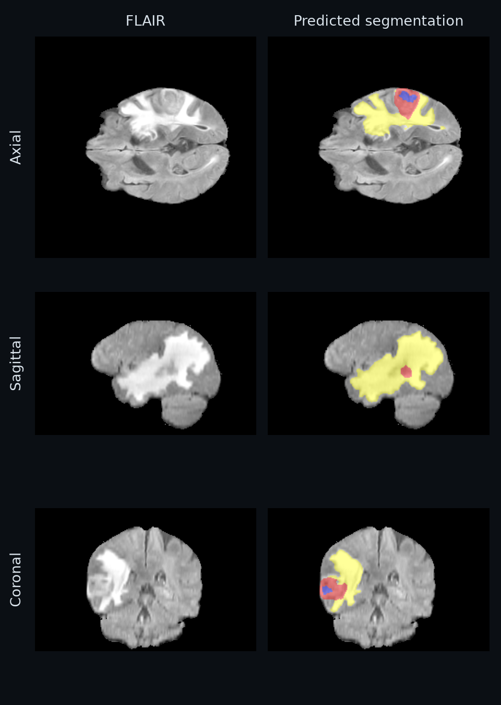
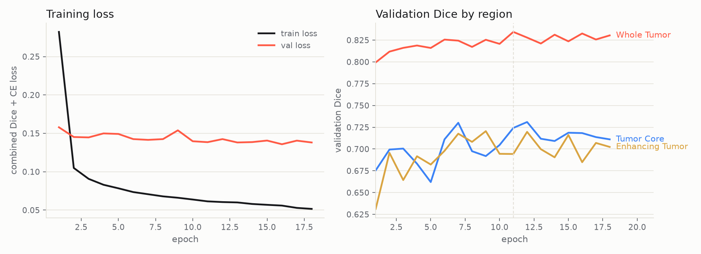
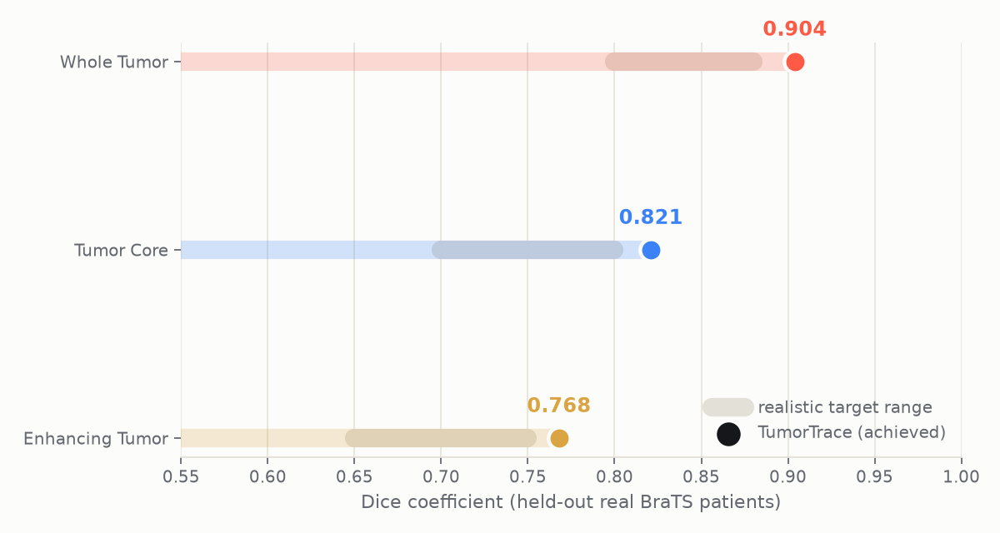

# TumorTrace

**TumorTrace finds the exact boundary of a brain tumor on an MRI scan in seconds.** It is a pixel-level segmentation model trained on 368 real glioma patients from the BraTS 2020 challenge, wrapped in a viewer built for looking closely at a scan, not for making a diagnosis.

> **This is a research and educational prototype, not a medical device.** It has not been clinically validated and must never be used for actual diagnosis or treatment decisions. Segmentation outputs should only ever be interpreted by a qualified radiologist or neuro-oncologist.



I want to say upfront what this project is and isn't. It is a real, working, end-to-end system: real data, a real training run, real evaluation numbers on patients the model never saw. It is not a substitute for a radiologist, and it never will be, that's not a caveat I'm hedging with, it's the actual design intent. What follows is the how and the why.

## How it works

A glioma doesn't look the same on every MRI sequence, which is exactly why radiologists order more than one. T1ce (the contrast-enhanced scan) lights up the actively growing rim of the tumor. FLAIR and T2 make the surrounding swelling, the edema, hard to miss. Plain T1 gives you the baseline anatomy everything else gets compared against. TumorTrace stacks all four into a single 4-channel volume and feeds it, slice by slice, into a U-Net with a ResNet34 encoder (pretrained on ImageNet, then fine-tuned on glioma tissue). For every pixel, the model outputs a probability over four classes: background, necrotic core, edema, and enhancing tumor. Those per-slice predictions get stitched back into a full 3D volume, colorized, and laid over the scan so you can see the tumor's shape, its extent, and how its sub-regions are actually arranged, not just a blob where "something's wrong."

## Why 2D slices instead of a full 3D model

The honest answer is compute. A full volumetric 3D network (something like nnU-Net's ensemble) will beat this approach on paper, current published results put state-of-the-art 3D pipelines a few points higher on Whole Tumor Dice. But 3D segmentation networks are hungry: they want multiple GPUs and days of training time, which rules out training one on a free Colab instance or a single consumer laptop GPU. A 2D slice-based U-Net trains in about ninety minutes on a single GPU and segments a full brain on a CPU in a couple of seconds. That's the trade I made, and given how close the real results below land to the 3D ceiling, I think it was the right one for what this project is trying to be: something you can actually run, not just read about.

## Results

Trained on 368 of the 369 BraTS 2020 training patients (one has a corrupted segmentation file in the public release, more on that in [`BUILD_NOTES.md`](BUILD_NOTES.md)) and evaluated on 56 held-out patients the model never saw during training or validation. Early stopping cut training off at epoch 18 of a planned 50, once validation Dice on the whole tumor stopped improving.



<!-- RESULTS_TABLE_START -->
| Region | Dice | HD95 (mm) | Sensitivity | Specificity |
|---|---|---|---|---|
| Whole Tumor (WT) | 0.904 | 15.47 | 0.888 | 0.999 |
| Tumor Core (TC) | 0.821 | 8.95 | 0.808 | 0.999 |
| Enhancing Tumor (ET) | 0.768 | 5.28 | 0.783 | 0.999 |
<!-- RESULTS_TABLE_END -->

Before training, I wrote down realistic target ranges for this approach based on published results for comparable 2D methods (WT 0.80 to 0.88, TC 0.70 to 0.80, ET 0.65 to 0.75), specifically so I couldn't quietly move the goalposts after the fact. All three regions cleared the top of their range.



Dice and sensitivity tell a clean story. HD95 is the honest complication: it's the 95th-percentile Hausdorff distance, essentially "how far off is your worst-case boundary point," and it punishes small stray false-positive islands far more harshly than Dice does, since Dice is a volume-overlap measure and barely notices a handful of misclassified voxels sitting somewhere they shouldn't be. A WT Dice of 0.90 with an HD95 of 15mm is a normal combination for this kind of model, not a contradiction: it means the bulk of the tumor is segmented very accurately while a small number of outlier pixels elsewhere in the brain pull the worst-case distance up. It's worth knowing about before you stare at that number and wonder what went wrong. Nothing did.

Here's what that segmentation actually looks like against ground truth, on real held-out test patients:


Most of these are close calls between the model and the radiologist who drew the ground truth. A couple aren't: there's a case in there where the model calls something enhancing tumor and the ground truth calls it necrotic core, which is a genuinely hard distinction even for people who do this for a living, since both can look similar on a single modality and the real signal is often subtle contrast enhancement patterns across sequences. I'd rather show that slice than hide it.

## App features

The point of the app isn't just "upload a scan, see a colored blob." Once a volume is loaded, inference runs exactly once and everything below is free:

- **Multi-planar viewing.** Independent Axial, Sagittal, and Coronal tabs, all reformatted from the same predicted 3D volume, no extra inference cost per tab.
- **An actual 3D render.** A fourth tab renders the brain and the tumor as a real, rotatable, zoomable 3D volume using [NiiVue](https://niivue.github.io), the same WebGL viewer used in published neuroimaging research. It runs entirely in your browser, drag to rotate it, scroll to zoom, and there's a cross-section slider so you can cut into the volume and see the tumor from the inside.
- **A model-confidence heatmap**, toggled in place of the label overlay, showing per-voxel max-softmax confidence. It's usually high everywhere except right at the boundary between tissue types, which is exactly where you'd want a model to admit some uncertainty.
- **Overlay controls**: opacity, per-sub-region visibility (hide edema to see the enhancing core more clearly, say), and an optional colorblind-friendly mode that adds dot, stripe, and crosshatch textures on top of the color, so the overlay doesn't rely on hue alone.
- **A tumor-extent profile**, a small chart of tumor voxel count across every slice in the current plane, with the current slice marked, so you can jump straight to the largest cross-section instead of scrubbing blindly.
- **A downloadable report**, markdown, with per-region volumes and the slice indices of interest, alongside a `.nii.gz` download of the full predicted mask.
- **Test-time augmentation** on by default: every prediction averages the original slice with its horizontal flip (mirroring an augmentation the model actually trained under), for a small, real accuracy improvement at roughly double the inference cost, which is still comfortably under a second per slice.

There's also a [standalone product site](site/index.html) (`site/index.html`), a three.js-animated overview of the project separate from the working app. Serve it locally with `python -m http.server` from the repo root and open `http://localhost:8000/site/index.html`, or deploy the `site/` folder as-is to GitHub Pages, Vercel, or Netlify. Edit the two config values at the bottom of the file (`appUrl`, `githubUrl`) to point at your own deployment before sharing it.

## Architecture

```
                      ┌─────────────────────────────┐
  T1    ──┐           │                             │
  T1ce  ──┼── stack ──▶  4-channel (192×192) slice   │
  T2    ──┤           │                             │
  FLAIR ──┘           └───────────────┬─────────────┘
                                       │
                                       ▼
                     ┌──────────────────────────────────┐
                     │   U-Net (segmentation_models_    │
                     │   pytorch), ResNet34 encoder,     │
                     │   ImageNet-pretrained             │
                     └───────────────┬────────────────────┘
                                       │  4-class logits (192×192)
                                       ▼
                     ┌──────────────────────────────────┐
                     │ argmax → {bg, necrotic, edema,    │
                     │ enhancing} pixel labels           │
                     └───────────────┬────────────────────┘
                                       │  stack across slices
                                       ▼
                     ┌──────────────────────────────────┐
                     │  3D predicted mask + per-region    │
                     │  volume (cm³) + color overlay      │
                     └──────────────────────────────────┘
```

## Dataset

Trained on **BraTS 2020** (pre-operative multimodal MRI from glioma patients), sourced from the Kaggle mirror [`awsaf49/brats20-dataset-training-validation`](https://www.kaggle.com/datasets/awsaf49/brats20-dataset-training-validation), with the [Medical Segmentation Decathlon Task01_BrainTumour](http://medicaldecathlon.com/) as a no-login fallback. Every volume ships already skull-stripped, co-registered, and resampled to 1mm³ isotropic resolution (240×240×155).

If you use this data or build on this work, please cite the BraTS papers, not this repo:

```bibtex
@article{menze2015brats,
  title   = {The Multimodal Brain Tumor Image Segmentation Benchmark (BRATS)},
  author  = {Menze, Bjoern H. and Jakab, Andras and Bauer, Stefan and others},
  journal = {IEEE Transactions on Medical Imaging},
  year    = {2015}
}

@article{bakas2017advancing,
  title   = {Advancing The Cancer Genome Atlas glioma MRI collections with expert
             segmentation labels and radiomic features},
  author  = {Bakas, Spyridon and Akbari, Hamed and Sotiras, Aristeidis and others},
  journal = {Nature Scientific Data},
  year    = {2017}
}
```

BraTS data usage terms apply: research and educational use only.

## Run it yourself

### 1. Install

```bash
git clone <this-repo-url> && cd tumortrace
python -m venv .venv && source .venv/bin/activate
pip install -r requirements.txt
```

### 2. Get the data

Kaggle retired the old `kaggle.json` key file in favor of a plain bearer token. Generate one at [kaggle.com/settings/api](https://www.kaggle.com/settings/api) and save it to `~/.kaggle/access_token`, then:

```bash
kaggle datasets download -d awsaf49/brats20-dataset-training-validation
unzip brats20-dataset-training-validation.zip -d data/raw
```

The zip extracts training and validation data as siblings (`data/raw/BraTS2020_TrainingData/MICCAI_BraTS2020_TrainingData/...`); point `preprocess.py` at the `BraTS2020_TrainingData` branch specifically, since the validation patients have no segmentation labels to train on. If Kaggle access isn't available, [Task01_BrainTumour](http://medicaldecathlon.com/) works as a fallback; `preprocess.py` only cares about filename suffixes, not which source populated the directory.

### 3. Preprocess

```bash
python preprocess.py --raw_dir data/raw/BraTS2020_TrainingData --out_dir data/processed
```

### 4. Train

```bash
python train.py --processed_dir data/processed --max_epochs 50
```

`model.best_available_device()` picks CUDA, then Apple Silicon's MPS backend, then falls back to CPU. On an M4 Pro, MPS trained about 13x faster than CPU per batch, which is the difference between an afternoon and the better part of a week. `train.ipynb` runs the identical pipeline in Colab or a local Jupyter kernel, if you'd rather work in notebook cells.

### 5. Evaluate

```bash
python evaluate.py --raw_dir data/raw/BraTS2020_TrainingData --processed_dir data/processed --checkpoint checkpoints/best_model.pt
```

Writes `results/metrics_table.md` and `results/qualitative_examples.png`.

### 6. Run the app

```bash
streamlit run app.py
```

Ships with 3 bundled real BraTS test cases in `samples/`, so the app works immediately without any data download.

## Repository structure

```
tumortrace/
├── README.md
├── requirements.txt
├── constants.py          # label maps, region defs, geometry, overlay colors
├── preprocess.py          # NIfTI -> normalized 2D slice pairs + patient split
├── dataset.py             # PyTorch Dataset + augmentation
├── model.py               # U-Net + Dice/CE loss + region-Dice metrics + device selection
├── train.py                # training loop (source of truth)
├── train.ipynb             # Colab/local-portable notebook wrapping train.py
├── evaluate.py              # test-set Dice/HD95/sensitivity/specificity + qualitative grid
├── inference.py             # segment_volume(): NIfTI dir -> 3D predicted mask, with TTA
├── viewer3d.py               # NiiVue-based 3D viewer HTML builder
├── app.py                    # Streamlit interactive viewer
├── make_samples.py            # builds samples/*.npz from the test split
├── checkpoints/best_model.pt
├── samples/                   # 3 bundled real demo cases (.npz)
├── site/index.html             # standalone three.js product site
├── results/
│   ├── metrics_table.md
│   ├── qualitative_examples.png
│   └── figures/                # training curves, results charts, multi-planar renders
├── dev_tools/                  # synthetic-data generator, for sandboxes with no data/GPU access
└── BUILD_NOTES.md
```

## Limitations

Writing these down is part of doing this honestly, not an afterthought.

- **2D, not 3D.** The model sees one axial slice at a time; it has no explicit information about what's happening in the slices above or below. A full 3D or 2.5D (multi-slice-context) model would likely close some of the gap to the nnU-Net ceiling mentioned earlier.
- **One institution's worth of scanners, roughly.** BraTS pools data from multiple sites, but it's still a curated research dataset. Real-world scanner variation, unusual tumor presentations, and post-surgical cavities are all things this model hasn't necessarily seen.
- **HD95 is worse than Dice makes it look.** See the results discussion above; the boundary-distance metric is the one to watch if you care about worst-case behavior, not just average overlap.
- **No DICOM support.** Clinical scanners speak DICOM; this pipeline speaks NIfTI. Converting is a solved problem elsewhere, just not one this repo solves for you.
- **Not validated on anything but BraTS.** No external test set, no multi-site generalization study, no radiologist-in-the-loop evaluation. That's a much bigger undertaking than one repo, and it's exactly the gap between "research prototype" and "medical device."

## Explicitly out of scope

2D slice-based only (no 3D volumetric model), no auth, no mobile app, no DICOM support (NIfTI only), no multi-GPU training.

## Disclaimer, restated

> **This is a research and educational prototype, not a medical device.** It has not been clinically validated and must never be used for actual diagnosis or treatment decisions. Segmentation outputs should only ever be interpreted by a qualified radiologist or neuro-oncologist.
